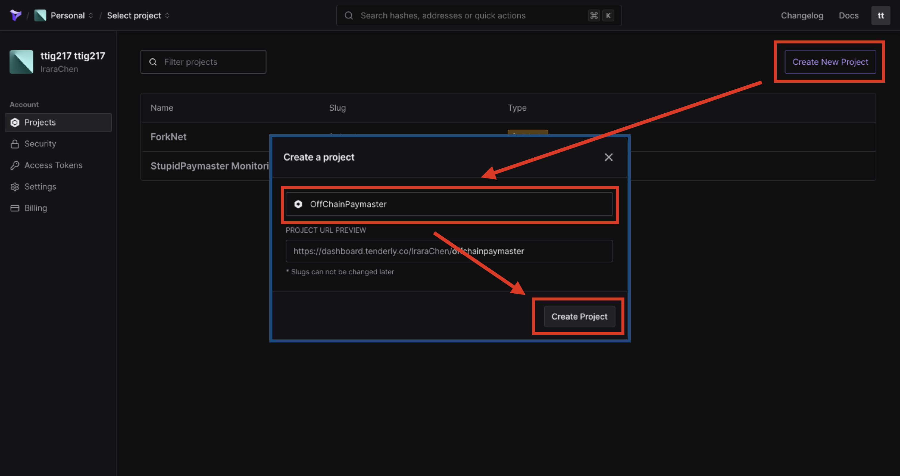
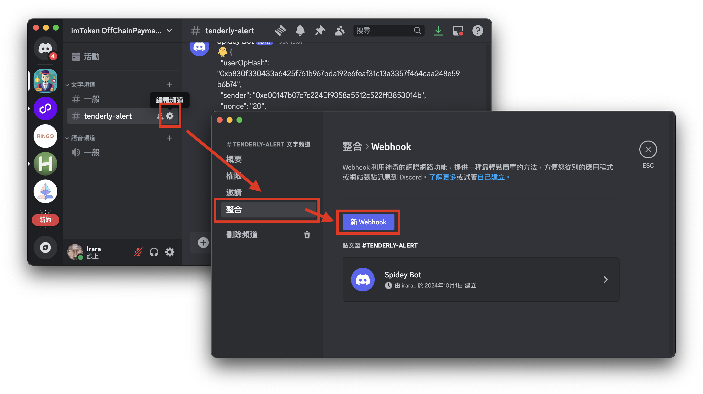
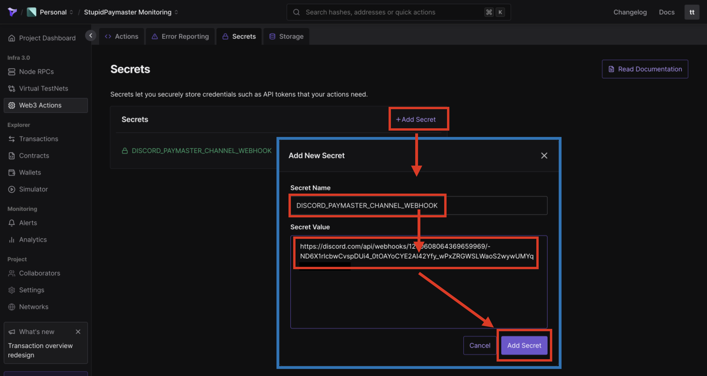

# OffChainPaymaster-for-Tenderly-Action

## Prerequisites

1. Please create an account on [Tenderly](https://dashboard.tenderly.co/), then build a project



2. This action uses a Discord WebHook to handle OffChainPaymaster messages. Request a WebHook URL from the designated Discord channel



3. In Tenderly’s Web3 Actions, add a secret "DISCORD_PAYMASTER_CHANNEL_WEBHOOK" and set the WebHook URL



4. Install Tenderly CLI on local

```shell
brew tap tenderly/tenderly && brew install tenderly
```

## Deployment

1. Clone action from github

```shell
### Clone the project
git clone https://github.com/oneleo/OffChainPaymaster-for-Tenderly-Action.git
cd OffChainPaymaster-for-Tenderly-Action/
```

2. Set your Tenderly account and project name, format: [account name]/[project name]
   - In this case, account is `irarachen`, and project name is `monitoring`

```shell
code tenderly.yaml

### Edit tenderly.yaml
# ...
actions:
  irarachen/monitoring:
# ...
###
```

3. Set your contract and target network ID to trigger
   - In this case, contract is `0x0000000071727De22E5E9d8BAf0edAc6f37da032`, network ID is `84532`

```shell
code tenderly.yaml

### Edit tenderly.yaml
# ...
            filters:
              - network: 84532
                # Transaction must come from the network with network ID
                status: success
                # Transaction must have succeeded
                to: 0x0000000071727De22E5E9d8BAf0edAc6f37da032
                # Transaction must have been sent to EntryPoint contract
                contract:
                  address: 0x81d7a78C455730d0cdEcD5123793C9596ABBf53a
                  # transaction must have involved the OffChainPaymaster contract
# ...
###
```

4. Login to Tenderly and deploy action

```
### Authenticate using your login token:
### You can get a token here: https://dashboard.tenderly.co/account/authorization
tenderly login

### Build your Action project:
tenderly actions build

### Deploy your Action to Tenderly Web3 Actions:
tenderly actions deploy
```

5. In [offChainPaymasterAction.ts](https://github.com/oneleo/OffChainPaymaster-for-Tenderly-Action/blob/action-for-paymaster/actions/offChainPaymasterAction.ts#L320-L331), when OffChainPaymaster is in `ChargeInPostOp` mode and emits a `PostOpRevertReason` event, you'll receive event details on Discord.
