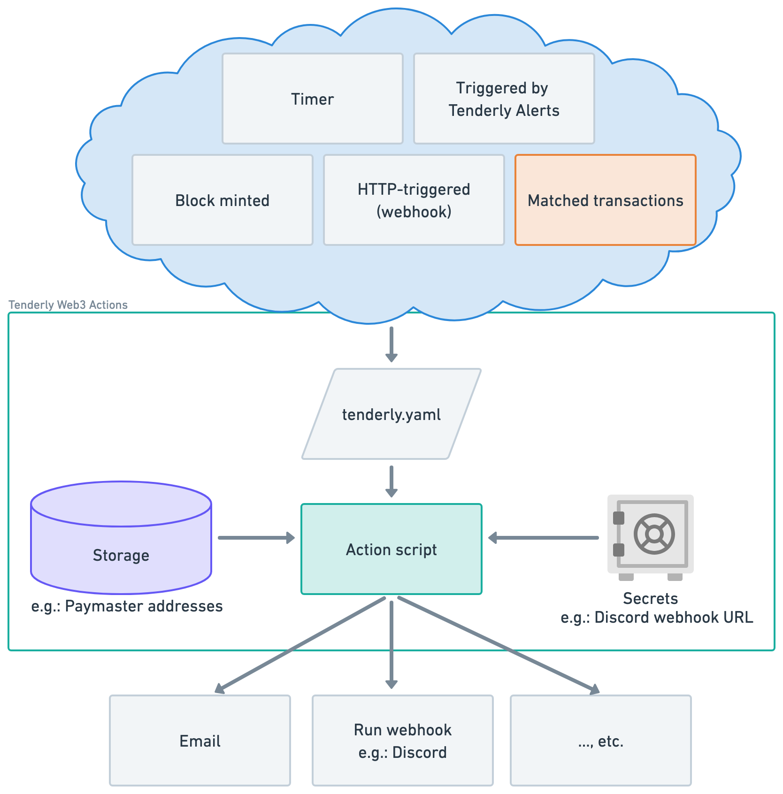
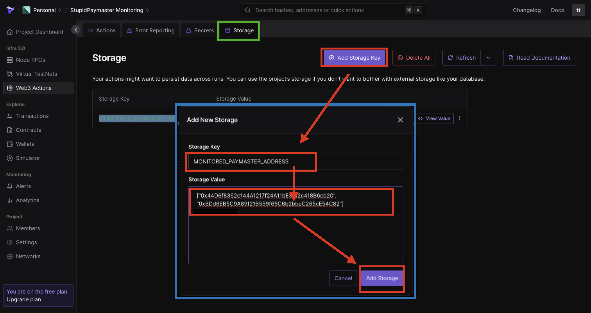

# OffChainPaymaster-for-Tenderly-Action

## Tenderly Web3 Actions overview



## Prerequisites

1. Please create an account on [Tenderly](https://dashboard.tenderly.co/), then build a project


2. This action uses a Discord WebHook to handle OffChainPaymaster messages. Request a WebHook URL from the designated Discord channel


3. In Tenderly’s Web3 Actions, add a secret "DISCORD_PAYMASTER_CHANNEL_WEBHOOK" and set the WebHook URL


4. Similarly, create a Slack webhook at [https://my.slack.com/services/new/incoming-webhook](https://my.slack.com/services/new/incoming-webhook) and store its URL in the `SLACK_PAYMASTER_CHANNEL_WEBHOOK` variable within Tenderly Web3 Secrets.

5. Add a storage entry "MONITORED_PAYMASTER_ADDRESSES" as a string array, e.g., `["0x44D6f8362c144A1217f24A11bE35f2c418B6cb20","0xBDd6EB5C9A89f21B559f65C6b2bbeC265cE54C82","0x4779C973b060c9cc1592b404cAd9CB5AFB0d4B52"]`.



6. Install Tenderly CLI on local

```shell
brew tap tenderly/tenderly && brew install tenderly
```

## Deployment

1. Clone action from github

```shell
### Clone the project
git clone https://github.com/oneleo/OffChainPaymaster-for-Tenderly-Action.git
cd OffChainPaymaster-for-Tenderly-Action/
```

2. Set your Tenderly account and project name, format: [account name]/[project name]
   - In this case, account is `irarachen`, and project name is `monitoring`

```shell
code tenderly.yaml

### Edit tenderly.yaml
# ...
actions:
  irarachen/monitoring:
# ...
###
```

3. Set your network ID, target contract, and filter events using topics[0].
   - In this case, network ID = `84532` (Base Sepolia), target contract = EntryPoint (`0x0000000071727De22E5E9d8BAf0edAc6f37da032`),
   - and filter for UserOpProcessed event (topics[0] = `0x4a7d89094dad8258a8c7f96c6cad9b077fe57305ac3e2da96478295d1b48c7d9`) from OffChainPaymaster at `0xBDd6EB5C9A89f21B559f65C6b2bbeC265cE54C82`

```shell
code tenderly.yaml

### Edit tenderly.yaml
# ...
            filters:
              - network: 84532
                # Transaction must come from the network with network ID 84532
                status: success
                # Transaction must have succeeded
                to: 0x0000000071727De22E5E9d8BAf0edAc6f37da032
                # Transaction must have been sent to EntryPoint contract
                logEmitted:
                  # Transaction must have emitted a log entry
                  contract:
                    address: 0xBDd6EB5C9A89f21B559f65C6b2bbeC265cE54C82
                    # coming from the OffChainPaymaster contract at this address
                  startsWith:
                    # and topics of the log entry must start with either one of these
                    - 0x4a7d89094dad8258a8c7f96c6cad9b077fe57305ac3e2da96478295d1b48c7d9
# ...
###
```

4. Login to Tenderly and deploy action

```
### Authenticate using your login token:
### You can get a token here: https://dashboard.tenderly.co/account/authorization
tenderly login

### Build your Action project:
tenderly actions build

### Deploy your Action to Tenderly Web3 Actions:
tenderly actions deploy
```

5. In [offChainPaymasterAction.ts](https://github.com/oneleo/OffChainPaymaster-for-Tenderly-Action/blob/action-for-paymaster/actions/offChainPaymasterAction.ts#L320-L331), when OffChainPaymaster is in `ChargeInPostOp` mode and emits a `PostOpRevertReason` event, you'll receive event details on Discord.

## Test

1. Run Tests

```
### Navigate to the actions directory and execute the tests
(cd actions/ && npm run test)
```
